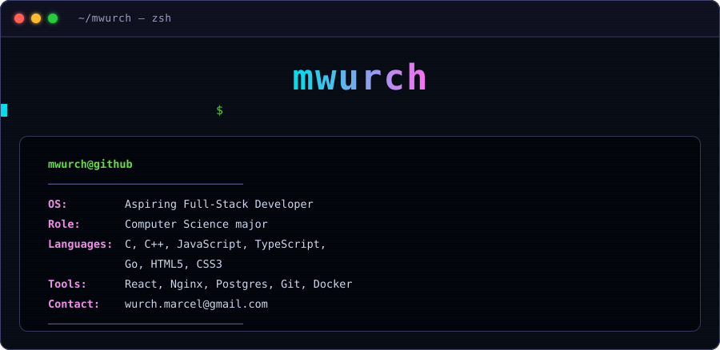

  

<h2 align="center">Marcel Wurch</h2>

  <strong>Systems &amp; full-stack developer</strong> — trained at 42 School

  📍 Germany &nbsp;·&nbsp; 💻 On-site or remote &nbsp;·&nbsp; 🟢 <strong>Open to working student, internship &amp; junior roles</strong>

  
  &nbsp;
  

---

I learn by building things from scratch. Rather than wiring libraries together, I've reimplemented
the pieces underneath them — an **HTTP/1.1 server**, a **Unix shell**, and the **C standard library**
are all in the repositories below. That foundation now runs upward into TypeScript, React and Go.

> **What is 42?** A tuition-free engineering program with no lectures and no teachers. Everything is
> learned by building real projects from zero, reviewed by peers. Admission is through a
> month-long selection process with a low acceptance rate.

## 🚀 Featured work

Every project below is written from scratch — no frameworks, no scaffolding, no boilerplate generators.

| Project | What it does | Built with |
| :--- | :--- | :--- |
| **[webserv-42](https://github.com/mwurch/webserv-42)** *HTTP server* | A working **HTTP/1.1 web server** built on raw POSIX sockets. Non-blocking I/O driven by `poll()`, PHP **CGI** execution for dynamic pages, multipart **file uploads** with an image gallery, and an Nginx-style **config parser** with server blocks and route locations. | `C++` `POSIX sockets` `Make` |
| **[c-projects](https://github.com/mwurch/c-projects)** *Systems fundamentals* | Four low-level builds: **libft** (the C standard library, reimplemented), **get_next_line** (buffered stream reader), **minishell** (a working Unix shell), and **philo** (the dining philosophers problem, solved with threads and mutexes). | `C` `pthreads` `Make` |
| **[cpp](https://github.com/mwurch/cpp)** *Object-oriented C++* | Nine progressive modules covering classes and orthodox canonical form, inheritance and polymorphism, operator overloading, exceptions, templates, and the STL containers and algorithms. | `C++` `Make` |
| **[inception](https://github.com/mwurch/inception)** *Infrastructure* | A multi-service environment built from **hand-written Dockerfiles** — no prebuilt images. **Nginx** with TLS as the sole entry point, **WordPress** on PHP-FPM, and a **MariaDB** instance, wired together with custom Docker networks and persistent volumes. | `Docker` `Nginx` `MariaDB` `Shell` |

## 🛠 Stack

| Area | Technologies |
| :--- | :--- |
| **Systems** | C · C++ · POSIX · pthreads · sockets · Make · Linux |
| **Web** | TypeScript · JavaScript · React · HTML5 · CSS3 |
| **Infrastructure** | Docker · Nginx · Git · MariaDB · PostgreSQL |
| **Currently learning** | Go |

## 📫 Get in touch

I'm open to **working student positions, internships, and junior developer roles** in Germany —
on-site or remote.

- ✉️ **[wurch.marcel@gmail.com](mailto:wurch.marcel@gmail.com)**
- 💼 **[LinkedIn](https://www.linkedin.com/in/YOUR-LINKEDIN-HANDLE)**
